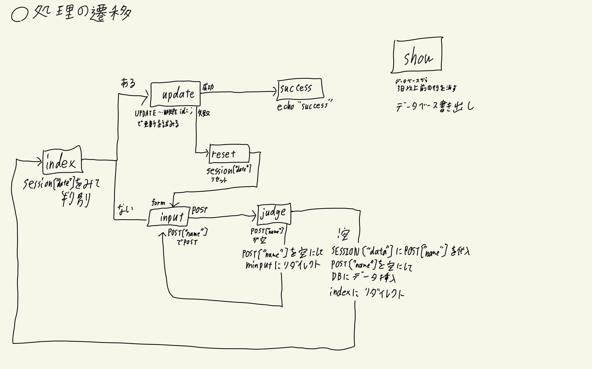

# Bath-management

## ファイル構成など

## サーバー

| DB-server        | web-server       |
| :--------------: | :--------------: |
| Apache2 / 2.4.52 | Apache2 / 2.4.52 |
| PHP / 8.1.2      | PHP / 8.1.2      |
| Mysql / 8.0.31   | Mysql-client / 8.0.31 |
| php-mysql        | php-mysql        |
| git / 2.34.1     | git / 2.34.1     |

### 処理の流れ



### conf.php （例）

```php
<?php
    function conf($parameter) {
        if($parameter == "dbname") {
            return "bath_data_base";
        } elseif ($parameter == "dbhost") {
            return "localhost";
        } elseif ($parameter == "dbusername") {
            return "root";
        } elseif ($parameter == "dbpassword") {
            return "Abc445566@";
        } elseif ($parameter == "dbtable") {
            return "member";
        } else {
            echo "error";
        }
    }
?>
```

## 経緯

[blog](https://hitto.me/blog/2022-11.html)を見たらわかるかも。

## 振り返り

[Bath-managementの振り返り](https://hitto.me/blog/bath-management.html)に、その振り返りを書いていきます。
